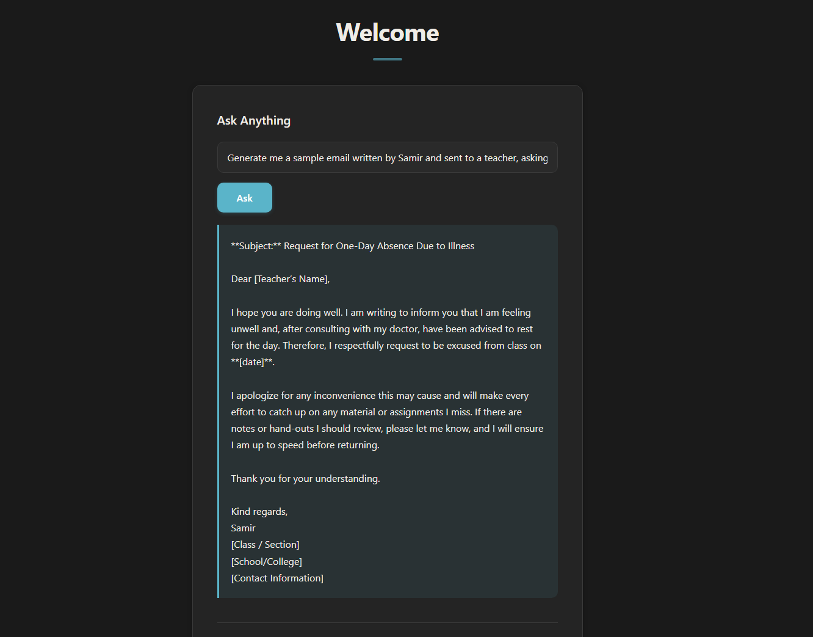
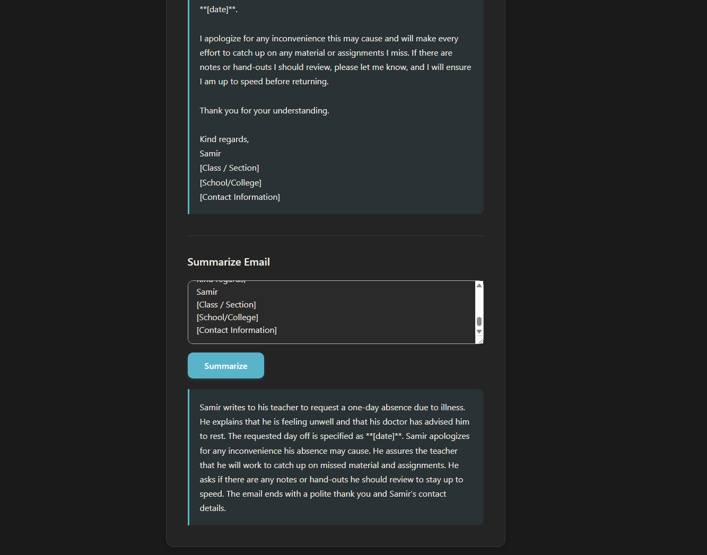

# MailBrief

A lightweight web-based AI assistant built with Flask. It can answer general questions and summarize emails using an LLM served through the Groq API.

## Features

- **Ask Anything** – Submit any question and get an AI-generated response.
- **Email Summarizer** – Paste an email and receive a concise 6–7 sentence summary.
- Simple, responsive web interface (HTML, CSS, JavaScript).
- Asynchronous requests with loading indicators for a smooth user experience.

## Screenshots




## Tech Stack

| Layer    | Technology                      |
| -------- | ------------------------------- |
| Backend  | Python, Flask                   |
| AI Model | Groq API (`openai/gpt-oss-20b`) |
| Frontend | HTML, CSS, JavaScript           |
| Config   | python-dotenv                   |

## Project Structure

```
Personalized-AI-Assistant/
├── main.py                # Flask app and API routes
├── templates/
│   └── index.html         # Main page
├── static/
│   ├── script.js           # Frontend logic (fetch requests)
│   └── style.css           # Styling
└── .gitignore
```

## Prerequisites

- Python 3.9 or higher
- A [Groq API key](https://console.groq.com/keys)

## Installation

1. **Clone the repository**

   ```bash
   git clone https://github.com/Samir-BK/Personalized-AI-Assistant.git
   cd Personalized-AI-Assistant
   ```

2. **Create and activate a virtual environment** (recommended)

   ```bash
   python -m venv venv
   source venv/bin/activate   # On Windows: venv\Scripts\activate
   ```

3. **Install dependencies**

   ```bash
   pip install flask openai python-dotenv
   ```

4. **Set up environment variables**

   Create a `.env` file in the project root and add your Groq API key:

   ```
   GROQ_API_KEY=your_groq_api_key_here
   ```

## Usage

Start the Flask development server:

```bash
python main.py
```

The app will be available at `http://127.0.0.1:5000`.

- Use the **Ask Anything** form to send a question to the assistant.
- Use the **Summarize Email** form to paste in an email and get a summary.

## API Endpoints

| Endpoint     | Method | Description                               | Body Parameter |
| ------------ | ------ | ----------------------------------------- | -------------- |
| `/`          | GET    | Renders the main page                     | –              |
| `/ask`       | POST   | Returns an AI-generated answer to a query | `question`     |
| `/summarize` | POST   | Returns a summary of the provided email   | `email`        |

## Configuration Notes

- The application uses the Groq-hosted OpenAI-compatible API. If you'd like to use a different provider or model, update the `base_url` and `model` values in `main.py`.
- `app.run(debug=True)` is intended for local development. Disable debug mode before deploying to production.

## License

This project is licensed under the [MIT License](LICENSE).

## Author

**Samir B K**
GitHub: [@Samir-BK](https://github.com/Samir-BK)
